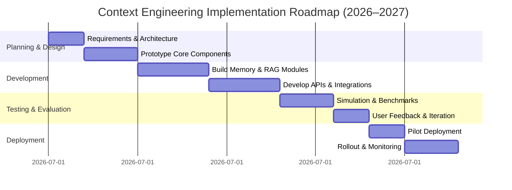

# Next-Gen Context Engineering

**Executive Summary:** Context engineering is the systematic management of all information fed into AI models – far beyond one-shot prompts. It combines prompt crafting, retrieval of external knowledge, conversational memory, tool outputs, and other multimodal data to optimally “fill the context window” with relevant tokens.  State-of-the-art approaches use retrieval-augmented generation (RAG), vector databases, memory stores, knowledge graphs, and multi-agent systems to extend and structure context.  Leading platforms (OpenAI, Anthropic, Google Gemini) now offer long-context models (100K–10M tokens) and built-in agent frameworks (sessions, memory banks) for context management.  However, developers report major pain points: tricky dependency installation (21% of support issues), tuning vector stores/RAG, agent orchestration, and evaluation gaps.  End users suffer from hallucinations and stale answers (e.g. 38% of reported AI errors are factual mistakes).  

We propose a novel **multi-tier context engine**: a Context Controller that orchestrates (a) a short-term *working memory* (the active prompt buffer), (b) a long-term *Knowledge Store* (hybrid vector DB + knowledge graph), (c) **summarization/compression modules**, and (d) a **personalization module** (user profiles/preferences).  Standardized APIs (inspired by Model Context Protocol) allow plugging in LLMs and tools.  The engine monitors the incoming conversation, retrieves relevant documents or memories, dynamically compresses context (via query rewriting or abstraction), and feeds a curated prompt to the LLM.  Privacy is built in (encrypted user data, IAM controls), and the system scales via distributed vector search and caching.  We integrate multimodal context by embedding images/audio into the knowledge store and allowing vision-language calls.  Evaluation goes beyond raw accuracy: we measure *context recall*, *hallucination rate*, *context efficiency*, and task success.  

The report details this architecture (see diagram below), data models (entities for facts, dialogues, tool outputs), APIs for context store/query, and outlines an implementation roadmap with phases.  We illustrate three prototypical use-cases (e.g. a personalized finance advisor, an enterprise research agent, an augmented-reality companion) with end-to-end workflows.  Finally, we discuss risks (privacy, bias, malicious context injection) and mitigation (consent, filtering, auditing), and compare alternative designs in a table of trade-offs.  Our approach leverages recent advances (LLMs with flash attention, hybrid retrieval, evaluation frameworks) to push “context engineering” into robust real-world systems.

## Definition and Scope of Context Engineering

 *Figure: Traditional prompt engineering (left) vs. full context engineering (right). An LLM’s context window acts like working memory for the model.* Context engineering is the **“delicate art and science of filling the context window with just the right information”**. In practical terms, *context* includes: 
- **Instructions and prompts:** system messages, few-shot examples, task definitions.  
- **Knowledge and facts:** retrieved documents, database entries, or world knowledge relevant to the task.  
- **Tools and actions:** outputs from APIs or tool-calls (e.g. calculator results, search snippets) that inform the LLM.  
- **Conversation history and memory:** prior user inputs, agent’s own reasoning steps, and long-term user profiles.  

Context engineering **transcends simple prompt design**. It acknowledges that an LLM’s context window is a limited resource; indiscriminately overloading it can cause “context rot” (where information in the middle of a long prompt is effectively forgotten). Thus, context engineers must *curate* and **optimize** all tokens fed into the model. In practice, this means dynamically retrieving relevant data (RAG), summarizing or compressing history, and managing what to keep in active memory vs. archive. Context engineering also covers *continuous prompting strategies* for long-running tasks: updating instructions and retrieved facts as an agent works over many turns.

## Current State of the Art

### Academic Research

Recent surveys formalize context engineering as a distinct discipline.  For example, an arXiv survey (July 2025) categorizes context engineering into **Context Retrieval** (information sourcing), **Context Processing** (summarization, filtering), and **Context Management** (state/memory over time). It notes implementation patterns like Retrieval-Augmented Generation (RAG), memory systems, tool-assisted reasoning, and multi-agent orchestration as central. Likewise, memory surveys highlight a need for *hybrid memory architectures*: short-term working memory (context window) plus long-term storage (e.g. vector databases). These works show that LLMs are deployed in multi-turn settings (chatbots, assistants, agents) where retaining information over long spans is crucial. They conclude that the core challenge is *selective retention and retrieval* of relevant facts, not just increasing token limits.  

State-of-the-art techniques include: 

- **Long-Context LLMs:** Modern models support massively larger context windows. For instance, Google’s Gemini 3.0 Pro and Meta’s Llama 4 Scout now offer 2M–10M token contexts. IBM notes larger windows yield *fewer hallucinations and more coherent outputs*. However, empirical studies find effective performance often drops well before advertised limits, with accuracy plunging when important information is in the middle of the input (the “lost-in-the-middle” problem).

- **Retrieval-Augmented Generation (RAG):** Embedding-based search is standard for injecting fresh knowledge. Papers and platforms describe multi-stage RAG pipelines that combine vector search, keyword filtering, re-ranking, and query expansion. The first stage retrieves the most relevant chunks, which are then compressed or summarized before being sent to the LLM. For example, Weaviate’s “Query Agent” reformulates user queries to match the data schema before vector lookup.

- **Memory and State:** Almost all agent frameworks now implement a memory module. Short-term memory holds recent dialogue turns and tool outputs, while long-term memory is an external store of facts or user history. Open-source tools like LlamaIndex explicitly model memory with FIFO chat buffers and optional long-term memories. Persistent memories can be tagged by user, time, or topic to enable personalization.

- **Tool and Agent Architectures:** New frameworks allow LLMs to invoke plugins (e.g. calculators, web search) in-context. OpenAI’s agent guide advises structuring apps so that ‘Data’ tools fetch needed context (e.g. DB queries). Multi-agent research interleaves LLM calls and tool calls, using each tool’s output as new context. LangChain identifies common pitfalls of long-agent runs (e.g. “context poisoning” if a hallucination enters memory) and suggests strategies (write/select/compress/isolate) to mitigate them.

- **Multimodal Context:** Next-gen models handle images and audio natively (e.g. Gemini’s vision, Llama’s video understanding). Academic work on multimodal context is emerging, linking image embeddings with language context. In practice, platforms store visual context as embeddings or descriptors and feed them to vision-language models.

### Industry Platforms and Open-Source Tools

Major cloud platforms now offer built-in context engines: Google’s Gemini Enterprise Agent Platform provides session management and a “Memory Bank” for personalized long-term memories. It even includes IAM-based access controls for memory. OpenAI and Anthropic encourage developers to build agents with tool integration and memory (e.g. OpenAI’s function-calling, Anthropic’s Claude Code) and partner with open protocols. The **Model Context Protocol (MCP)** is an open standard acting like a “USB-C port for AI”: LLMs (e.g. ChatGPT, Claude) can plug into MCP-compliant data sources and tools without custom integration. In essence, MCP and similar APIs allow any context (calendar data, docs, dev tools) to be seamlessly fed into a model.

Open-source frameworks dominate context engineering development. *LangChain* provides libraries for RAG, memory, agent orchestration and recently discussed context engineering strategies. *LlamaIndex* (formerly GPT-Index) offers memory classes and pipeline constructs for RAG, letting developers load documents into vector stores and set up agents with customizable memory buffers. Vector databases (Weaviate, Chroma, Pinecone, Qdrant, etc.) are widely used for context stores. For example, Weaviate’s own blog emphasizes that retrieval quality (“garbage in, garbage out”) and chunking strategy are critical for RAG performance. Many teams also build custom knowledge graphs or semantic indices to complement raw text.

**Strengths and Limitations:** The current toolkit can handle many scenarios, but gaps remain. RAG systems easily inject up-to-date information and scale (cloud vector DBs) but incur latency and can be brittle if queries are imprecise. Very large context windows reduce the need for external retrieval, improving coherence, yet still suffer from the “context rot” (as attention dilutes). Memory modules add personalization and continuity (like human short-term vs long-term memory), but raise complexity in deciding what information to save or drop. Multi-agent/tool architectures offer modularity (each agent can specialize) but introduce orchestration overhead and potential failures at integration points. Finally, much of the state-of-art relies on heuristic or ad-hoc methods; evaluation benchmarks for context and memory are still maturing.

## Unmet Needs and Pain Points

### Developer Pain Points

In practice, developers building context-rich AI systems encounter numerous hurdles. An analysis of thousands of developer Q&A posts identifies the top challenges as: 

- **Dependency and Deployment Issues (21%):** Conflicts between libraries, hard-to-install tooling, and rapid churn in the AI stack make setup difficult.  
- **Vector Store and RAG Engineering:** Integrating embedding models and vector DBs is common but nontrivial, accounting for ~10% of issues. Choosing chunk sizes, handling large data ingestion, and debugging retrieval pipeline failures are recurrent pains (Weaviate notes that bad chunking leads to retrieval failures and hallucination).  
- **Orchestration Complexity (13%):** Coordinating multiple LLM calls and tools (agents invoking sub-agents) often breaks in subtle ways. Developers struggle to debug workflows when the system silently “forgets” earlier steps or drops context, as noted by context rot phenomena.  
- **Reliability and Evaluation (15%):** Ensuring robust, correct outputs over long interactions is hard. There are few standard metrics; developers resort to manual testing and tweaks.  
- **Tooling Gaps:** Even basic tasks like simple vector similarity or prompt chaining may require cutting-and-pasting examples. Developer productivity suffers from lack of mature integration tools (though open protocols like MCP help).

### User Pain Points

End users similarly experience limitations due to naive context handling. Empirical studies show that LLM hallucinations and outdated knowledge are top user complaints. For example, analysis of 3 million app-store reviews found ~1.75% explicitly report LLM hallucinations (e.g. wrong facts, irrelevant or nonsensical answers). Users vividly describe these failures as “My AI is lying to me,” noting that confidently wrong answers break trust. Other common issues include:

- **Forgetting Earlier Instructions:** Chatbots often lose track of the conversation as it grows. Atlan reports that after ~20 turns, a chatbot may contradict itself because the earliest directives have fallen out of the context window.  
- **Stale Information:** Users encounter “knowledge cutoff” problems when models cannot reflect recent events or personal context. RAG can mitigate this, but users note that simple retrieval agents still “don’t reason about recency” unless explicitly designed to do so (e.g. not updating user location or profile).  
- **Incoherent Multi-Task Responses:** In multi-step tasks, users see drift. For instance, an agent that accesses a user’s calendar but later suggests appointments on the wrong day indicates broken context chaining. According to user feedback, each tool-invocation complicates context, leading to outputs that *look* fluent but silently ignore prior info.  
- **Lack of Personalization:** Without persistent memory, assistants ignore user preferences or previous interactions. Personalized agents (storing user facts) feel more helpful, but current systems rarely implement this well in general products.

In sum, both developers and users need richer context management. Developers want modular, reliable components for RAG, memory, and agent flow. Users want consistency, up-to-date knowledge, and personalization — all of which demand a more advanced context infrastructure.

## Proposed Next-Gen Context Engineering Architecture

We propose a **Context Engine** framework addressing the above gaps (see architecture diagram below). Its core components and data flows are:

```mermaid
flowchart LR
    U[User] --> UI[Chat UI / App]
    UI --> AM[Agent Orchestrator]
    AM -->|Calls with context| LLM[LLM Model API]
    AM -->|Fetches context| CM[Context Manager]
    CM --> EKM[Long-Term Memory \n(Vector DB + KG)]
    CM --> Retrieval[Retrieval Engine]
    Retrieval --> EKM
    CM --> Summarizer[Summarization Module]
    Summarizer --> CM
    LLM -->|Invokes tools| Tools[Tool/Plugin APIs]
    Tools --> LLM
    LLM --> UI
``` 

**Figure: High-level architecture for next-gen context engineering.** The **Agent Orchestrator** manages the workflow: on each user query it consults the **Context Manager** to gather relevant information, then prompts the LLM. The Context Manager oversees two memory tiers: a **working memory** (recent conversation turns, in-context variables) and an **external knowledge store** (a hybrid of a vector database and knowledge graph). The Retrieval Engine searches the long-term store for pertinent documents or facts. A Summarization Module compresses large contexts (e.g. by abstractive summarization or extracting key facts) to fit token limits. The orchestrator also handles **tools** (search, calculators, user APIs) by injecting their outputs into context. A Personalization submodule connects the Memory Bank (long-term user profile/preferences) so that user-specific data can be retrieved.

### Core Components and Data Models

- **Working Memory (Short-Term):** Implements a rolling window of the most recent dialog and tool outputs (e.g. last N utterances or steps). This is kept lean to avoid token overload. It can use techniques like *sliding windows* or *priority queues* (dropping least-relevant tokens).

- **Long-Term Knowledge Store:** A scalable vector database holds embeddings of documents, past conversations, and persistent user facts. We also maintain a **context graph** schema (entities and relations) where possible. Each memory entry has metadata (source, timestamp, owner). Data models include:  
  - *MemoryItem*: (text, embedding, userID, timestamp, tags).  
  - *ContextGraph*: nodes for entities/concepts linked by relations (e.g. “owns(car)”).  

- **APIs:** We define a service interface for context operations. Key endpoints include:  
  1. `AddMemory(userID, text)` – stores a new memory fragment for a user (with embedding).  
  2. `QueryMemory(userID, queryVec)` – retrieves top-k relevant memory chunks.  
  3. `SummarizeContext(text)` – returns an abstractive summary of input text.  
  4. `StreamLM(prompt)` – query LLM with constructed prompt (token streaming supported).  
  5. `CallTool(toolID, input)` – wrapper to external APIs (e.g. search, calendar).  

- **Model Integration:** The engine supports major LLM endpoints (OpenAI’s API, Anthropic, local Llama models, etc.). Models are chosen per task: e.g. a 16K-context model for complex reasoning, a smaller 4K model for simple queries. Embeddings and retrieval use specialized models (e.g. OpenAI’s embedding API or CLIP for images).  

- **Privacy & Security:** All personal data in memory is encrypted at rest. Access controls (e.g. identity-based policies) ensure that an agent only reads memory entries belonging to the user. Google’s platform uses IAM policies on its Memory Bank. By default, shared context (public facts) and private context (personal user info) are separated. Auditing logs track all memory reads/writes for compliance. We also sandbox tool execution (as in Google’s Agent Platform) to prevent arbitrary code abuse.

- **Scalability & Latency:** The vector DB and retrieval engine are horizontally scalable (e.g. sharded indices). We use approximate nearest neighbor (ANN) search with caching of recent queries. The Summarizer can be run asynchronously or with a smaller model to reduce LLM latency. To minimize tokens, the controller prioritizes context by relevance (using semantic similarity scores) and trims less important data. Parallelism is exploited: while the LLM is generating, background threads can pre-fetch context for predicted next steps (speculative retrieval).

- **Multimodal Context:** Beyond text, the Context Engine accepts image/audio inputs. Visual context (e.g. a user-supplied photo) is encoded into vectors (via CLIP) and indexed in the memory. During queries, relevant images or segments are retrieved and optionally captioned or visual tokens are inserted into the prompt. For example, an AR assistant might retrieve landmarks’ images from memory when a user asks a vision-based question.

- **Personalization & Transferability:** Each user session has a profile vector (the aggregate of their history). Recommendations or generated content are modulated by this profile (e.g. a finance agent tailors advice to a risk-averse profile). We support **transferrable prompts**: standardized context templates that can be applied across similar tasks (informed by protocols like MCP). For example, a “research summary” context pattern can be reused by multiple agents with different domain data. 

- **Evaluation Metrics:** We propose to evaluate context engines on multiple criteria: *factual recall* (percentage of queries where the needed fact was in memory), *context relevance* (semantic similarity between prompt and query), *hallucination rate* (frequency of unsupported model assertions), *throughput* (tokens/sec given retrieval load) and *user task success* (end-to-end accuracy on benchmark tasks). Recent work suggests specialized metrics for memory functionality are needed. We also include human-in-the-loop tests (e.g. does the agent maintain coherence over 50 turns). 

 *Figure: Standardized context integration via Model Context Protocol (MCP). The Context Engine exposes plug-in data sources (files, APIs, tools) to any LLM through an open API.* 

### Implementation Roadmap

We outline a phased development plan:

1. **Phase 1 – Design & Prototyping (Q3 2026):** Define system requirements, data models, and APIs. Build prototypes of core modules: a simple context store (using e.g. Weaviate or Chroma) and a summarization service (e.g. GPT-4 with reduced context). Create basic integration with one LLM API and a vector DB. Develop initial evaluation suite for retrieval accuracy and memory tests.  
2. **Phase 2 – Core Engine Development (Q4 2026–Q1 2027):** Implement the full Context Manager and Agent Orchestrator. Integrate multiple retrieval strategies (keyword + vector, hybrid search). Develop the personalization memory store and API. Add tool frameworks (e.g. Wolfram Alpha, web search) with a secure agent executor. Begin iterative testing of orchestration logic.  
3. **Phase 3 – Optimization & Scaling (Q2–Q3 2027):** Scale up the vector index (distributed clusters). Implement caching layers and asynchronous context prefetch. Optimize summarization (e.g. fine-tune model for concise summaries). Build monitoring dashboards. Conduct performance benchmarking (see timeline chart below) and refine component-level metrics.  
4. **Phase 4 – Pilot and Refinement (Q4 2027):** Deploy pilot applications (see use-cases below). Collect user/developer feedback. Improve privacy safeguards (e.g. user consent flows) and bias mitigation (filtering offensive or misleading content). Prepare documentation and go-to-market integration (MCP connectors, plugin marketplace).



**Technology Stack Options:** We would leverage Python or Go for service implementation, with PyTorch/TensorFlow for any custom models. The vector store could be Weaviate, Qdrant or Pinecone (all support hybrid search). Knowledge graphs could use Neo4j or TigerGraph. LLM calls go via official APIs (OpenAI, Anthropic) or local Llama variants. Deployment targets could be Kubernetes clusters on cloud (AWS/GCP) or on-prem based on user needs. Major LLMs can plug in via our API wrapper (no model-specific changes needed).  

**Integration with LLM Platforms:** Our design assumes the LLM is a black box; the Context Controller simply formats its input. For example, with OpenAI we’d use function calls for tools; with Google Gemini we’d use the Agent Runtime API. The same context API can feed any LLM so long as it can consume JSON/text prompts. Protocols like MCP ensure portability: a new tool or memory store can register as an MCP server and be instantly usable by any compliant agent.  

### Use-Case Prototypes

We detail three exemplar applications demonstrating end-to-end context engineering:

1. **Personal Finance Advisor (FinanceBot):**  
   - *Scenario:* A user asks how to allocate retirement savings. The bot pulls the user’s risk profile (from personal memory), retrieves current market data (via financial news API), and runs the user’s transaction history through a budgeting tool. The retrieved data and memory are summarized and fed to the LLM, which outputs a tailored investment plan. The user’s reaction (e.g. “I prefer more bonds”) is stored for future personalization.  
   - *Flow (sequence):*  

   ```mermaid
   sequenceDiagram
       participant U as User
       participant A as FinanceBot
       participant R as RAG System
       participant M as Memory Store
       participant L as LLM
       U->>A: "How should I adjust my 401(k) with current market trends?"
       A->>M: Fetch user profile (risk tolerance, past advice)
       M-->>A: (Risk-averse, prefers bonds)
       A->>R: Query market database and news
       R-->>A: Returns recent market summary
       A->>L: Prompt({Question, MarketSummary, UserProfile})
       L-->>A: "Suggested portfolio: 60% bonds, 30% index funds..."
       A->>M: Update memory with user response/preferences
       A->>U: Delivers investment plan
   ```  
   - *Success Criteria:* Advice accuracy (validated by a financial expert), user satisfaction scores, and retention of user preferences in future sessions.

2. **Enterprise Research Agent (CorpResearch):**  
   - *Scenario:* A corporate analyst asks a chatbot for insights on a client’s industry. The system retrieves internal documents (reports, emails), public data (web search), and the company’s historical notes. It uses a knowledge graph of corporate entities to link concepts. The agent reasons through a multi-step workflow (e.g. summarizing each document chunk, then synthesizing). It personalizes output based on the analyst’s known expertise level. The final report references company-specific terminology correctly.  
   - *Flow Highlights:* The context engine first expands abbreviations using the corporate glossary in memory, then performs RAG on internal databases (ensuring confidential data stays internal). It batches dozens of pages via hierarchical summarization and feeds the condensed info to the LLM. The agent cross-checks answers by re-querying internal vector stores for verification (chain-of-thought).  
   - *Success Criteria:* F1-score on question-answer benchmarks over company docs, latency under target (e.g. <5s), and evaluation by staff for usefulness and accuracy.

3. **AR Context Companion (VisionBot):**  
   - *Scenario:* Using smart glasses, a user walks through a factory asking questions ("What is the temperature setpoint for that machine?"). The system captures the scene (image), recognizes the machine’s model, and queries the engineering database. The visual context (photo) is encoded and matched with stored images of equipment. The agent retrieves the machine’s spec sheet (via text retrieval) and past maintenance logs. The LLM answer integrates these multimodal cues and cites data (e.g. “The setpoint is 75°F according to spec #1234” with a confidence score).  
   - *Flow Highlights:* The context manager first runs an object detector (tool) to identify equipment, then retrieves corresponding records. It also accesses the user’s role (engineer vs. operator) from profile to tailor the explanation level. All image and text evidence is logged in context for audit.  
   - *Success Criteria:* Object identification accuracy, correct data retrieval (aligned with real sensors), user acceptance in a field trial, and safety checks (no hallucinated safety-critical info).

## Risks, Ethics, and Mitigations

Advanced context systems raise important risks:

- **Privacy:** Storing user data (preferences, history) can infringe privacy if misused. Mitigation: encrypt data at rest, require explicit user consent for memory saving, and allow users to review/delete their memory (opt-out). Isolate sensitive context (e.g. medical info) in a dedicated encrypted store, and purge it when no longer needed.

- **Data Security:** Integration with tools/APIs could leak data. We sandbox all tool executions (as in Google’s “secure sandbox” model) and validate outputs. Use rate limiting and anomaly detection on context queries to prevent credential scraping or injection attacks.

- **Bias and Fairness:** Context from historical data may encode bias. We must apply filtering (e.g. remove slurs or skewed sources) and fairness testing on generated responses. Memory entries that reflect user preferences should not perpetuate harmful stereotypes.

- **Hallucinations and Poisoning:** Ironically, context engineering must defend against malicious or incorrect context. We implement countermeasures: 
  * *Context Validation:* Check retrieved facts against multiple sources.  
  * *Content Filtering:* Block or flag obviously false or toxic content entering memory.  
  * *Human-in-the-Loop:* For high-stakes answers, have the system provide sources or ask for human confirmation.  
LangChain warns of “context poisoning” (a hallucination that gets fed back into memory); our logging and versioning of memory (with revision history) helps identify and roll back corrupt entries.

- **Ethical Use:** Ensure transparency: responses should indicate when they are based on retrieved facts vs. model inference. Store usage logs for auditing. Establish a feedback channel so users can report issues. Finally, comply with regulations (GDPR, HIPAA, etc.) by design (data minimization and user control over personal context).

## Alternative Approaches and Trade-offs

| Approach                        | Strengths                                           | Limitations                                         |
|---------------------------------|-----------------------------------------------------|-----------------------------------------------------|
| **Extended Context Window** (just push token limit) |  – Simplicity (no extra systems) <br> – Better coherence with more info |  – Diminishing returns (“context rot”) <br> – Very high compute/cost, latency <br> – No structure (harder to inject fresh data) |
| **Flat RAG (Vector DB + LLM)**  |  – Fresh, scalable knowledge access <br> – Separates retrieval from reasoning |  – Retrieval latency can be high <br> – Quality depends on query framing <br> – May still overload context if too many docs |
| **Hybrid Memory Architecture** (ours) |  – Combines benefits of RAG and stateful memory <br> – Personalization & long-term retention <br> – Automated context management (summarization, prioritization) |  – Higher system complexity (many components) <br> – Storage and maintenance overhead <br> – Risk of stale or irrelevant long-term memories |
| **Knowledge Graph** (static ontologies)  |  – Structured, explainable knowledge <br> – Efficient for well-defined domains (e.g. product database) |  – Expensive to build/maintain at scale <br> – Hard to capture unstructured nuance <br> – Limited adaptability to novel topics |
| **Multi-Agent Orchestration** |  – Modular: specialized agents can handle distinct subtasks <br> – Parallel exploration of solutions <br> – Reuse of existing bots |  – Coordination overhead (complexity of emergent behavior) <br> – Difficult debugging <br> – Still relies on each agent’s context strategy |

Our **multi-tier memory + retrieval system** aims to balance these trade-offs: it uses structured retrieval (vector+hybrid search) like RAG, retains long-term memories for personalization, and employs summarization to simulate “unlimited” context without exorbitant cost. It avoids purely monolithic memory (which can’t scale) while improving on one-off prompt-only approaches (which hallucinate).

